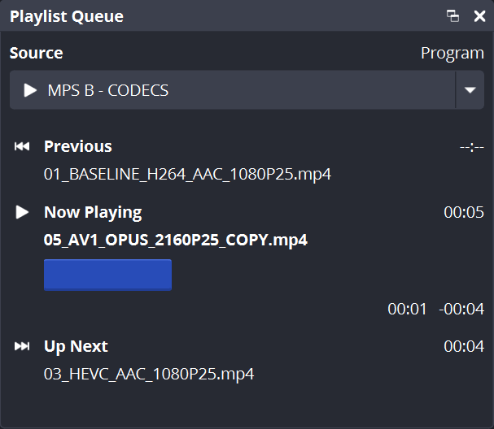
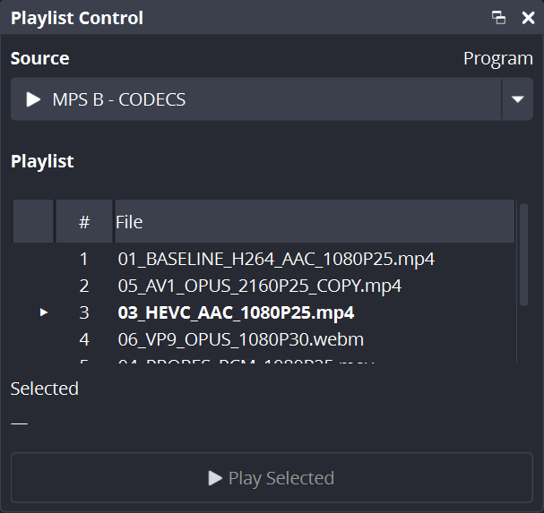

# Media Playlist Source

[](https://github.com/Vencite/media-playlist-source/releases)
[](https://github.com/CodeYan01/media-playlist-source)
[](https://obsproject.com/)
[](https://github.com/Vencite/media-playlist-source/blob/master/LICENSE)

An enhanced and actively maintained OBS Studio plugin for media playlists, built on OBS Media Source. It provides playlist behavior similar to VLC Video Source while keeping playback inside OBS Media Source.

<p align="center">
  
</p>

<p align="center">
  
</p>

## About this fork

This is an independently maintained fork of [CodeYan01/media-playlist-source](https://github.com/CodeYan01/media-playlist-source), maintained by Vencite.

The fork started as a production-focused fix for visible gaps between playlist items, introducing dual-source A/B playback with preloading for seamless transitions. It also includes corrected decoder audio routing and additional reliability and workflow improvements for live OBS use.

The original plugin was created by Ian Rodriguez / CodeYan01.

## Features

- **NEW in 0.1.5:** **Playlist Queue** dock showing Previous, Now Playing and Up Next, including duration, playback progress and Program-scene status.
- **NEW in 0.1.5:** **Playlist Control** dock for browsing the configured playlist and safely starting any selected file or folder item.
- **NEW in 0.1.5:** Optional **Follow Program MPS** mode for both docks, available from their right-click menus.
- Plays playlists of local files, folders, and URLs supported by FFmpeg.
- Allows editing the playlist without restarting playback, including reordering items.
- Allows editing source settings without restarting the current video.
- Saves the currently playing file so it can be resumed when OBS restarts.
- Allows selecting a file or folder item directly from the playlist.
- Uses VLC 4-style shuffle behavior:
  - Items can be added or removed without reshuffling the already established history.
  - Previously played items remain available through Previous Item.
  - Selecting a file or folder item does not break shuffle history.
  - The playlist reshuffles after the last file is played without discarding history.
- Shows the filename of the current file in the Properties window.
- Can start with either the first file or the previously current file when the source is restarted.
- Preloads the next local video and switches between internal A/B decoders to avoid the blank or transparent frame that can otherwise appear between consecutive files.
- Routes decoder audio through the parent Media Playlist Source so its mixer gain, mute state, filters, and OBS track routing remain authoritative.
- Both docks are available through OBS's Docks menu and support independent **Follow Program MPS** behavior from their right-click context menus.

## Installation

Download the latest Vencite build from the [GitHub Releases page](https://github.com/Vencite/media-playlist-source/releases).

Current releases provide builds for:

- Windows x64: installer and portable packages.
- macOS: universal package for Apple Silicon and Intel Macs.
- Linux x86_64: Debian package.

The current build configuration targets OBS Studio 31.1.1 and the fork is tested on OBS Studio 32.

## Limitations

- The Properties window shows the current filename, but it cannot be updated automatically when playback advances because doing so can cause OBS to crash while the Properties window is being interacted with. Reopening Properties refreshes the displayed filename.
- Programmatic playlist updates must preserve or provide each entry's `uuid`. OBS generates and preserves those IDs for editable-list changes made in the Properties UI; the plugin uses them to keep duplicate entries and the current item distinct. See [OBS PR #11126](https://github.com/obsproject/obs-studio/pull/11126).
- Audio track and subtitle selection are not supported yet.
- Folder contents are not refreshed automatically yet. Saving the source settings again refreshes them manually.

## For developers

To inspect the keys stored in the source [settings](https://docs.obsproject.com/reference-sources#c.obs_source_get_settings), use [obs_data_get_json](https://docs.obsproject.com/reference-settings#c.obs_data_get_json) or inspect the scene collection JSON. The implementation is in [`src/media-playlist-source.c`](src/media-playlist-source.c).

To select a file programmatically:

```c
proc_handler_t *ph = obs_source_get_proc_handler(source);
struct calldata cd = {0};
calldata_set_int(&cd, "media_index", 3); // 4th file
calldata_set_int(&cd, "folder_item_index", 3); // 4th folder item of the 4th file
proc_handler_call(ph, "select_index", &cd);
calldata_free(&cd);
```

`media_index` is the zero-based index of the file in the playlist.

`folder_item_index` is the zero-based index of the folder item inside the folder at `media_index`.

If the item at `media_index` is not a folder, `folder_item_index` is ignored. Out-of-range indexes are reset to `0`.

## Development and testing

Development of this fork uses AI-assisted coding tools where useful, but changes are reviewed, compiled in CI, and validated in OBS before being relied on in production.

Release validation notes are kept in [docs/release-notes](docs/release-notes), and the manual regression checklist is available in [tests/manual-regression.md](tests/manual-regression.md).
